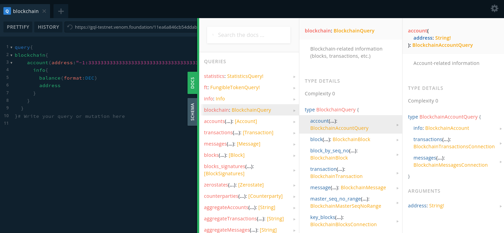

# GraphQL API Quick Start

This guide will help you familiarize yourself with Venom GraphQL API in four steps:

- observing API in sandbox playground
- reading API documentation
- making an API request with curl
- integrate API request with [Ever SDK](../using-ever-sdk-and-devtools-to-work-with-venom/readme.md)

## Playground

Go to https://gql-testnet.venom.foundation/graphql

Insert this query in the left part. 

```
query{
blockchain{
    account(address:"-1:3333333333333333333333333333333333333333333333333333333333333333"){
      info{
        balance(format:DEC)
        address
      }
    }
  }
}
```

Now click play button and you will see the result:


## Documentation

Click on the button **DOCS** on the right. You will see the API documentation with all available fields:



## Request with curl

Use this command in terminal to get the same data as in the playground sample above:

```shell
curl --location --request POST 'https://gql-testnet.venom.foundation/graphql' \
--header 'Content-Type: application/json' \
--data-raw '{"query":"query($address: String!){\n  blockchain{\n    account(address:$address){\n      info{\n        balance(format:DEC)\n      }\n    }\n  }\n}","variables":{"address":"-1:3333333333333333333333333333333333333333333333333333333333333333"}}'
```

## Request with SDK (JavaScript)

This is an example of how to integrate a similar query into JS SDK.

```js
const {TonClient} = require("@eversdk/core");
const {libNode} = require("@eversdk/lib-node");

TonClient.useBinaryLibrary(libNode)

const client = new TonClient({
    network: {
        endpoints: [
            "https://devnet-sandbox.evercloud.dev/graphql"
        ],
    },
});

(async () => {
    try {
        // Get account balance. 
        const query = `
            query {
              blockchain {
                account(
                  address: "${address}"
                ) {
                   info {
                    balance(format: DEC)
                  }
                }
              }
            }`
        const {result}  = await client.net.query({query})
        console.log(`The account balance is ${result.data.blockchain.account.info.balance}`);
        client.close();
    }
    catch (error) {
        console.error(error);
    }
}
)()
```

## What's next?

For more specific guidance on implementing your use case with the help of the GraphQL API, consult the [Specialized Guides](graphql-api-guides.md).