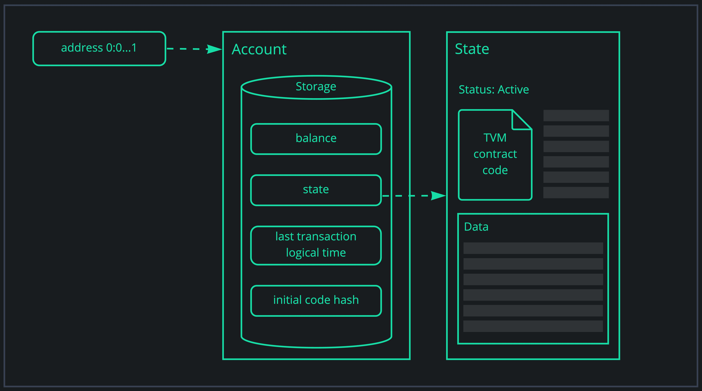

# Accounts

:::info
If you need to create a wallet account and don't care about the technical details then you can follow [this article](../general/create-a-new-wallet-account.md).
:::

Usually, an account means the user's identity in the blockchain. An account has an address, stores a balance, can send and receive funds, and calls smart contracts. In particular cases, an account is a smart contract with state storage.

Ethereum accounts can be externally owned (controlled by anyone with private keys) or deployed as smart contracts. In the Venom blockchain, an account and a smart contract are the same things. Here we don't have externally-owned accounts in the usual sense, and any accounts are smart contracts.

#### Account has the ability to:

* Receive, hold and send VENOM and tokens
* Receive external messages from outside the blockchain
* Send and receive messages inside the blockchain from other accounts
* Send external messages to nowhere (think of this as events in Ethereum)

#### **Venom accounts have two fields:**

`address` - The identifier by which an account is stored in the blockchain

`storage` - The storage contains balance, state, last transaction logical time, and initial code hash

## Address

The address is the entry point for inbound messages, and it's the unique identifier of the contract storage which stores such data as balance, state, last tx logical time, and initial code hash.

The account address is represented in two parts: an identifier of the workchain where 1st part is the account storage is located, and 2nd part is the hash of the initial data.

Example: `0:0000000000000000000000000000000000000000000000000000000000000000`

`0` – _workchain\_id._ An unsigned _32-bit_ integer is an identifier of a workchain.

`0000...0000` _– account\_id._ A _256-bit_ address is determined by the hash of the contract code and initial data.

### **Workchain IDs**

Currently defined workchain IDs list

| Workchain ID | Description                                                                                   |
| ------------ | --------------------------------------------------------------------------------------------- |
| -1           | The masterchain contains the information about a network configuration                        |
| 0            | The basic workchain is used by regular users to work with smart contracts and transfer tokens |

## Storage

* `last_trans_lt` - a last transaction logical time
* `balance` - the number of VENOMs on the account balance
* `init_code_hash` - hash of the contract code with which the contract was deployed for the first time
* `state` - a current state of an account, can be one of the following values:
  * _uninit - t_he account only has a balance; its code and data have not yet been initialized
  * _active - t_he account’s code and data have been initialized as well.
  * _frozen - t_he account’s code and data have been replaced by a hash, but the balance is still stored explicitly. The balance of a frozen account may effectively become negative, reflecting due storage payments.
  * _nonexist_

## Types of the wallet accounts

### Wallet accounts

Any users who needed to call smart contracts, store, send and receive Venom tokens in the network must have a wallet account. A wallet account is a smart contract in the Venom network designed for this purpose.

When a user wants to transfer some funds from a controlled wallet account to some other wallet account, In this case, the user sends a signed external message to the wallet account, then the wallet account authorizes the sender and allows them to pay for the transaction fee from their balance, and transfer funds from a wallet balance to the balance of another wallet account.

Anyone wanted to send tokens to another wallet account must know the recipient's address. The important concept here, there is an easy way to calculate an address even before the contract is deployed on the network and send funds to it. It follows that anyone can send tokens to a recipient whose contract has not yet been deployed, and those tokens will be accepted and the contract deployed.

### Default wallet

A wallet account with simple logic transferring funds. Suitable for most users.

### Multisig wallet

A multi-signature wallet is a wallet that is used by two or more users to enhance security by requiring signatures from multiple parties to sign transactions before execution.
